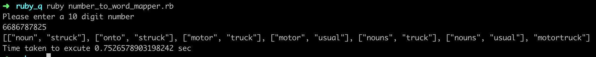
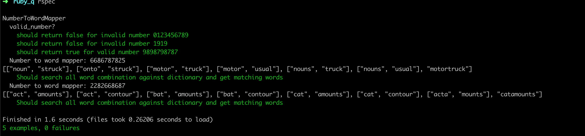

# Phone Number To Words Mapper

Ruby Program
Given a 10 digit phone number, will return all possible words or combination of words from the provided dictionary, that can be mapped back as a whole to the number.

#### Contents
 - Assumptions
 - Installation
 - Execution
 - Output Screens

## Assumptions

  - Number should be 10 digits
  - Number should not contain 0 & 1 digits
  - The matching word's length is atleast 3 characters

## Installation
  - Clone the repository
  - Go to repository folder: `cd phone_number_to_dictionary_words`
  - Install ruby 2.4.4
    - Using RVM: `rvm install 2.4.4` - Added .ruby-version file with the same 
  - Install `bundler` gem using `gem install bundler`
  - Get all dependencies: `bundle install`

## Execution
  - Run the program: `ruby number_to_word_mapper.rb`
  - Run the tests: `rspec`

## Output screen

#### Program Output

#### Test Output

